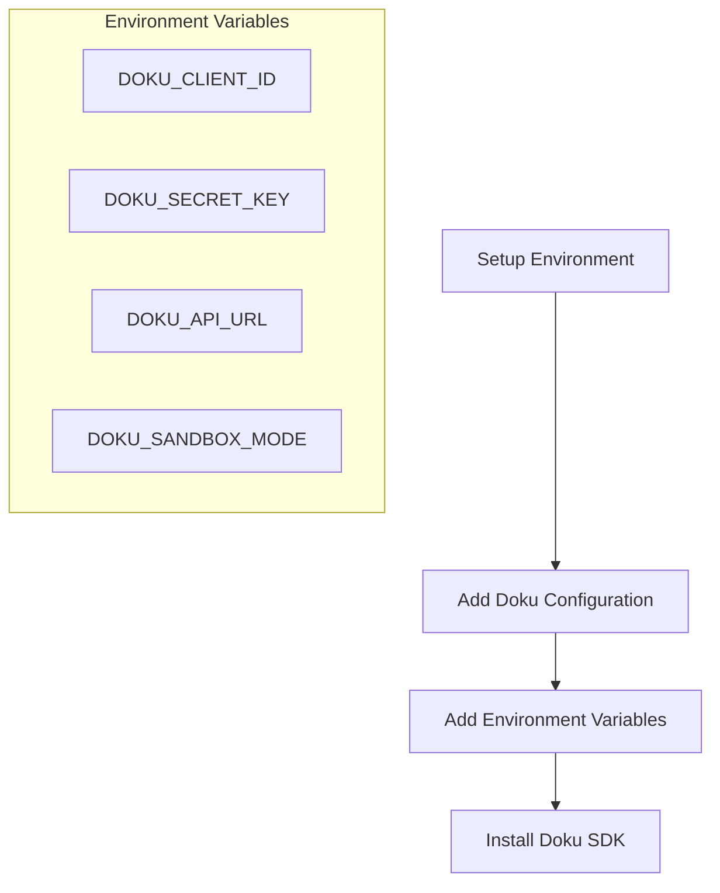
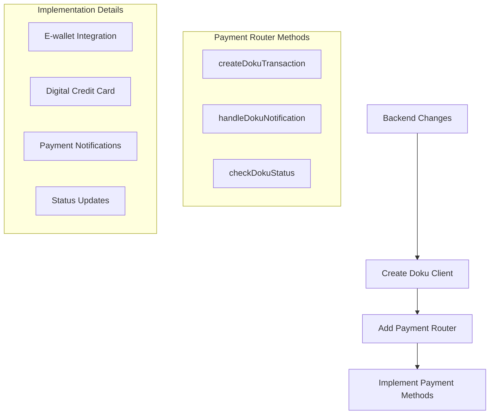
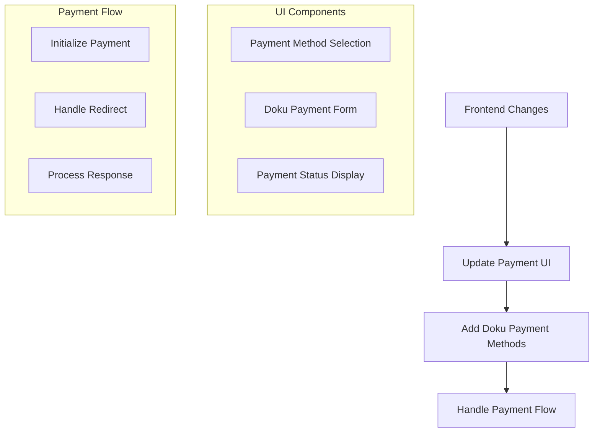

# Doku Payment Integration Plan

## 1. Environment Setup


## 2. Backend Changes


### 2.1 File Changes Required:
1. `src/server/api/routers/payment.ts`:
   - Add Doku client configuration
   - Add new payment router methods for Doku
   - Update existing payment status handling
   - Implement webhook handler for Doku notifications

2. Create new files:
   - `src/lib/payment/doku.ts` - Doku payment service implementation
   - `src/types/doku.ts` - TypeScript types for Doku integration

## 3. Frontend Changes


### 3.1 File Changes Required:
1. `src/app/(authenticated)/checkout/[memberID]/page.tsx`:
   - Add Doku payment method option
   - Implement Doku payment flow
   - Handle payment responses and status updates

## 4. Implementation Steps

1. Backend Implementation:
   - Set up Doku client configuration
   - Create payment transaction endpoints
   - Implement webhook handlers
   - Add payment status management
   - Update email notifications

2. Frontend Implementation:
   - Add Doku payment option to UI
   - Implement payment flow
   - Add payment status handling
   - Update UI for payment feedback

3. Testing:
   - Test payment flow in sandbox environment
   - Test webhook integration
   - Test error scenarios
   - Test payment status updates

4. Deployment:
   - Update environment variables
   - Deploy backend changes
   - Deploy frontend changes
   - Monitor initial transactions

## 5. Security Considerations
- Secure storage of Doku credentials
- Implement webhook signature verification
- Validate all payment responses
- Handle sensitive payment data securely

## 6. Monitoring and Logging
- Add payment transaction logging
- Monitor payment success/failure rates
- Track payment processing times
- Implement error tracking

## 7. API Integration Details

### 7.1 Environment Variables Required
```env
DOKU_CLIENT_ID=your_client_id
DOKU_SECRET_KEY=your_secret_key
DOKU_API_URL=https://api.doku.com
DOKU_SANDBOX_MODE=true/false
```

### 7.2 Payment Flow
1. Create payment transaction
2. Redirect to Doku payment page
3. Handle payment callback
4. Update transaction status
5. Send confirmation emails

### 7.3 Webhook Implementation
- Endpoint: `/api/webhooks/doku`
- Verify signature
- Update payment status
- Trigger email notifications

## 8. Error Handling
- Invalid payment data
- Failed transactions
- Timeout scenarios
- Network errors
- Webhook failures

## 9. Testing Checklist
- [ ] Sandbox environment setup
- [ ] Payment creation
- [ ] Payment flow
- [ ] Webhook handling
- [ ] Status updates
- [ ] Email notifications
- [ ] Error scenarios
- [ ] Security measures