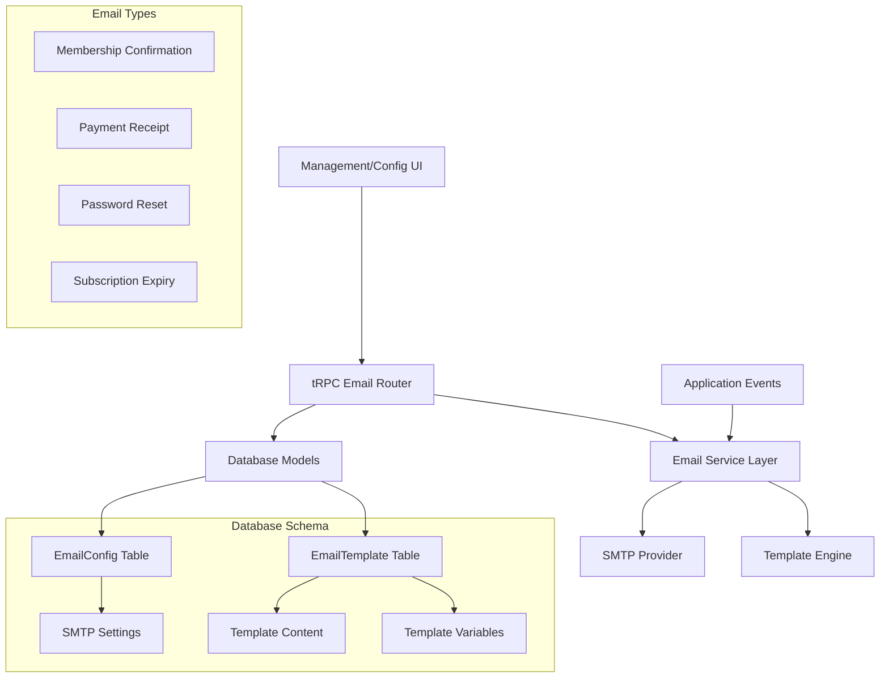

# Email SMTP Integration Plan

## 📋 Project Overview

This document outlines the comprehensive plan to integrate email SMTP functionality with configuration management in the FitInfinity application.

### Requirements
- **SMTP Configuration Management** - Admin interface to configure email settings
- **Email Template Management** - Manage templates for different transactional emails
- **Email Service Integration** - Send transactional emails (membership confirmations, payment receipts, password resets)
- **New Configuration Section** - Add to Management menu for easy access

## 🏗️ Architecture Overview



## 🗄️ Database Schema Design

### 1. EmailConfig Model
```prisma
model EmailConfig {
  id          String   @id @default(cuid())
  name        String   @unique // e.g., "primary", "backup"
  host        String
  port        Int
  username    String
  password    String   // encrypted
  fromEmail   String
  fromName    String
  useTLS      Boolean  @default(true)
  useSSL      Boolean  @default(false)
  isActive    Boolean  @default(false)
  isDefault   Boolean  @default(false)
  createdAt   DateTime @default(now())
  updatedAt   DateTime @updatedAt
}
```

### 2. EmailTemplate Model
```prisma
model EmailTemplate {
  id          String   @id @default(cuid())
  name        String   @unique
  type        EmailType
  subject     String
  htmlContent String   @db.Text
  textContent String?  @db.Text
  variables   Json     // Available template variables
  isActive    Boolean  @default(true)
  createdAt   DateTime @default(now())
  updatedAt   DateTime @updatedAt
}

enum EmailType {
  MEMBERSHIP_CONFIRMATION
  PAYMENT_RECEIPT
  PASSWORD_RESET
  SUBSCRIPTION_EXPIRY
  TRAINER_SESSION_REMINDER
}
```

### 3. EmailLog Model (for tracking)
```prisma
model EmailLog {
  id          String      @id @default(cuid())
  to          String
  subject     String
  templateId  String?
  status      EmailStatus
  errorMessage String?
  sentAt      DateTime?
  createdAt   DateTime    @default(now())
  
  template    EmailTemplate? @relation(fields: [templateId], references: [id])
}

enum EmailStatus {
  PENDING
  SENT
  FAILED
  BOUNCED
}
```

## 🔧 Implementation Components

### 1. tRPC Email Router (`src/server/api/routers/email.ts`)
- CRUD operations for email configurations
- CRUD operations for email templates
- Send email functionality
- Test email connection
- Email logs and statistics

### 2. Email Service Layer (`src/lib/email/`)
```
src/lib/email/
├── emailService.ts      // Main email service
├── smtpProvider.ts      // SMTP implementation
├── templateEngine.ts    // Template processing
├── emailTypes.ts        // Type definitions
└── templates/           // Default templates
    ├── membership-confirmation.html
    ├── payment-receipt.html
    └── password-reset.html
```

### 3. Management UI Components
```
src/app/(authenticated)/management/config/
├── page.tsx                    // Main config page with tabs
├── email-config/
│   ├── page.tsx               // SMTP configuration
│   ├── email-config-form.tsx  // SMTP form component
│   ├── test-connection.tsx    // Test SMTP connection
│   └── schema.ts              // Validation schemas
├── email-templates/
│   ├── page.tsx               // Template management
│   ├── template-form.tsx      // Template editor
│   ├── template-preview.tsx   // Preview component
│   ├── columns.tsx            // DataTable columns
│   └── schema.ts              // Template schemas
└── email-logs/
    ├── page.tsx               // Email logs viewer
    ├── columns.tsx            // Log columns
    └── schema.ts              // Log schemas
```

## 📱 User Interface Design

### 1. Configuration Dashboard
- **Tabbed Interface**: SMTP Settings | Email Templates | Email Logs
- **Quick Actions**: Test Connection, Send Test Email, View Recent Logs
- **Status Indicators**: Connection Status, Active Templates Count

### 2. SMTP Configuration Form
Form fields:
- Configuration Name
- SMTP Host
- Port (25, 587, 465)
- Username/Password
- From Email/Name
- Security (TLS/SSL)
- Connection Timeout
- Test Connection Button

### 3. Email Template Editor
Template management:
- Template Name & Type
- Subject Line (with variables)
- HTML Editor (rich text)
- Plain Text Version
- Variable Insertion Helper
- Preview Functionality
- Test Send Feature

## 🔐 Security Considerations

1. **Password Encryption**: SMTP passwords encrypted in database
2. **Permission-Based Access**: Only authorized users can manage email settings
3. **Input Validation**: Strict validation for all email configurations
4. **Rate Limiting**: Prevent email spam through rate limiting
5. **Audit Logging**: Track all configuration changes

## 📦 Required Dependencies

```json
{
  "nodemailer": "^6.9.8",
  "@types/nodemailer": "^6.4.14",
  "handlebars": "^4.7.8",
  "@types/handlebars": "^4.1.0",
  "html-to-text": "^9.0.5",
  "dompurify": "^3.0.7",
  "jsdom": "^23.2.0"
}
```

## 🚀 Implementation Phases

### Phase 1: Database & Core Setup
- [ ] Add database models to Prisma schema
- [ ] Create and run migrations
- [ ] Set up basic email service structure
- [ ] Install required dependencies

### Phase 2: Backend Implementation
- [ ] Create email tRPC router with CRUD operations
- [ ] Implement email service with SMTP integration
- [ ] Create template engine with variable substitution
- [ ] Add email sending functionality

### Phase 3: Frontend Implementation
- [ ] Update menu structure with Configuration section
- [ ] Create SMTP configuration interface
- [ ] Build email template management UI
- [ ] Implement email logs viewer

### Phase 4: Integration & Testing
- [ ] Integrate email sending into existing workflows
- [ ] Add email notifications to payment confirmations
- [ ] Implement membership confirmation emails
- [ ] Add password reset email functionality

### Phase 5: Advanced Features
- [ ] Email template preview and testing
- [ ] Email delivery statistics
- [ ] Bounce handling and retry logic
- [ ] Email queue management

## 🔄 Integration Points

### Existing Workflows to Enhance:
1. **Payment Confirmation** → Send receipt email
2. **Membership Creation** → Send welcome email
3. **Password Reset** → Send reset link email
4. **Subscription Expiry** → Send reminder emails
5. **Trainer Session Booking** → Send confirmation emails

## 📊 Menu Structure Update

```typescript
// Updated menu.ts structure:
{
  title: "Management",
  items: [
    // ... existing items
    {
      title: "Configuration",
      url: "/management/config",
      icon: Settings,
      requiredPermission: "manage:config",
      submenu: [
        {
          title: "Email Settings",
          url: "/management/config/email-config"
        },
        {
          title: "Email Templates", 
          url: "/management/config/email-templates"
        },
        {
          title: "Email Logs",
          url: "/management/config/email-logs"
        }
      ]
    }
  ]
}
```

## 🎯 Success Criteria

- [ ] Admin can configure SMTP settings through UI
- [ ] Admin can create and edit email templates
- [ ] System sends transactional emails automatically
- [ ] Email delivery is logged and trackable
- [ ] Templates support dynamic content insertion
- [ ] Connection testing works properly
- [ ] All email operations are permission-protected

## 📝 Technical Notes

### Email Template Variables
Common variables available across templates:
- `{{user.name}}` - User's full name
- `{{user.email}}` - User's email address
- `{{membership.id}}` - Membership ID
- `{{payment.amount}}` - Payment amount
- `{{payment.date}}` - Payment date
- `{{subscription.startDate}}` - Subscription start date
- `{{subscription.endDate}}` - Subscription end date
- `{{company.name}}` - Company name
- `{{company.address}}` - Company address

### SMTP Configuration Examples
**Gmail:**
- Host: smtp.gmail.com
- Port: 587 (TLS) or 465 (SSL)
- Security: TLS/SSL

**Outlook:**
- Host: smtp-mail.outlook.com
- Port: 587
- Security: TLS

**Custom SMTP:**
- Configurable host, port, and security settings

---

*This plan provides a comprehensive email SMTP integration that follows the existing project patterns and architecture. The implementation will be modular, secure, and easily maintainable.*