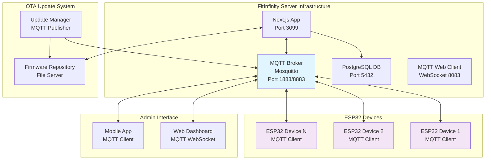

# MQTT Implementation Plan for FitInfinity ESP32 System

## Executive Summary

This document outlines the comprehensive implementation plan to migrate the FitInfinity ESP32 enrollment system from HTTP-based polling to an efficient MQTT-based real-time communication system. The implementation includes MQTT broker setup, real-time enrollment management, Over-The-Air (OTA) firmware updates, WiFi configuration management, and enhanced web dashboard integration.

## Current System Analysis

### Current Issues
- ESP32 devices continuously poll [`/api/esp32`](src/app/api/esp32/route.ts:43) for pending enrollments
- HTTP requests made every poll cycle (inefficient)
- [`getPendingEnrollments()`](src/server/api/routers/esp32.ts:73) requires constant server queries
- No real-time communication for immediate enrollment triggers
- High server load and network bandwidth usage

### Current Architecture
- Next.js backend with tRPC API routes
- PostgreSQL database with enrollment status tracking
- ESP32 devices using [`FitInfinityAPI`](lib/FitInfinityAPI.h:11) library
- Docker-based deployment (PostgreSQL + Next.js App)

## MQTT Architecture Design



## MQTT Topic Structure

```
fitinfinity/
├── devices/
│   ├── {deviceId}/
│   │   ├── enrollment/
│   │   │   ├── request          # Server → ESP32: New enrollment request
│   │   │   ├── status           # ESP32 → Server: Enrollment status updates
│   │   │   └── mode/switch      # Server → ESP32: Switch to enrollment mode
│   │   ├── attendance/
│   │   │   ├── fingerprint      # ESP32 → Server: Fingerprint logs
│   │   │   ├── rfid            # ESP32 → Server: RFID logs
│   │   │   └── bulk            # ESP32 → Server: Bulk attendance data
│   │   ├── status/
│   │   │   ├── online          # ESP32 → Server: Device online status
│   │   │   ├── heartbeat       # ESP32 → Server: Keep-alive messages
│   │   │   └── error           # ESP32 → Server: Error reporting
│   │   └── ota/
│   │       ├── available       # Server → ESP32: New firmware available
│   │       ├── download        # Server → ESP32: Download instructions
│   │       ├── progress        # ESP32 → Server: Update progress
│   │       └── status          # ESP32 → Server: Update completion status
│   │   └── config/
│   │       ├── wifi/request    # ESP32 → Server: WiFi configuration request
│   │       ├── wifi/response   # Server → ESP32: WiFi credentials
│   │       └── wifi/status     # ESP32 → Server: WiFi connection status
├── admin/
│   ├── enrollment/
│   │   ├── trigger             # Admin → Server: Trigger enrollment
│   │   └── notifications       # Server → Admin: Enrollment updates
│   └── devices/
│       ├── status              # Server → Admin: Device status updates
│       ├── commands            # Admin → Devices: Administrative commands
│       └── wifi/               # Admin → Devices: WiFi management
└── system/
    ├── broadcast/              # System-wide announcements
    └── maintenance/            # Maintenance mode notifications
```

## Implementation Components

### 1. MQTT Broker Setup (Mosquitto in Docker)

#### Docker Compose Integration

Add the following service to your existing [`docker-compose.yml`](docker-compose.yml:1):

```yaml
services:
  # ... existing services (db, app, seed)
  
  mosquitto:
    image: eclipse-mosquitto:2.0
    container_name: fitinfinity-mqtt
    restart: always
    ports:
      - "1883:1883"      # MQTT
      - "8883:8883"      # MQTT over SSL
      - "8083:8083"      # WebSocket
    volumes:
      - ./mqtt/config:/mosquitto/config
      - ./mqtt/data:/mosquitto/data
      - ./mqtt/log:/mosquitto/log
      - mosquitto_data:/mosquitto/data
    environment:
      - MOSQUITTO_USERNAME=fitinfinity_mqtt
      - MOSQUITTO_PASSWORD=mqtt_p@ssw0rd_f1n1t3
    networks:
      - fitinfinity-network

volumes:
  postgres_data:
  mosquitto_data: # Add this volume

networks:
  fitinfinity-network:
    driver: bridge
```

#### MQTT Configuration Files

Create `mqtt/config/mosquitto.conf`:

```
# Basic Configuration
listener 1883 0.0.0.0
listener 8883 0.0.0.0
listener 8083 0.0.0.0
protocol websockets

# Authentication
allow_anonymous false
password_file /mosquitto/config/passwords

# Logging
log_dest file /mosquitto/log/mosquitto.log
log_type error
log_type warning
log_type notice
log_type information

# Persistence
persistence true
persistence_location /mosquitto/data/

# Security (for production)
# cafile /mosquitto/config/ca.crt
# certfile /mosquitto/config/server.crt
# keyfile /mosquitto/config/server.key
```

### 2. Server-Side MQTT Integration

#### MQTT Service Implementation

Create `src/lib/mqtt/mqttService.ts`:

```typescript
import mqtt from 'mqtt';
import { EventEmitter } from 'events';

interface EnrollmentData {
  employeeId: string;
  employeeName: string;
  deviceId: string;
  fingerprintSlot: number;
}

interface FirmwareInfo {
  version: string;
  downloadUrl: string;
  checksum: string;
  size: number;
  releaseNotes?: string;
}

class MQTTService extends EventEmitter {
  private client: mqtt.MqttClient | null = null;
  private isConnected: boolean = false;

  constructor() {
    super();
  }

  async connect(): Promise<void> {
    const options: mqtt.IClientOptions = {
      host: process.env.MQTT_HOST || 'localhost',
      port: parseInt(process.env.MQTT_PORT || '1883'),
      username: process.env.MQTT_USERNAME || 'fitinfinity_mqtt',
      password: process.env.MQTT_PASSWORD || 'mqtt_p@ssw0rd_f1n1t3',
      clientId: `fitinfinity-server-${Date.now()}`,
      clean: true,
      reconnectPeriod: 5000,
    };

    this.client = mqtt.connect(options);

    return new Promise((resolve, reject) => {
      this.client!.on('connect', () => {
        console.log('MQTT Connected');
        this.isConnected = true;
        this.setupSubscriptions();
        resolve();
      });

      this.client!.on('error', (error) => {
        console.error('MQTT Connection Error:', error);
        reject(error);
      });

      this.client!.on('message', this.handleMessage.bind(this));
    });
  }

  // Enrollment Management
  async triggerEnrollment(deviceId: string, enrollmentData: EnrollmentData): Promise<boolean> {
    if (!this.isConnected || !this.client) {
      throw new Error('MQTT client not connected');
    }

    const topic = `fitinfinity/devices/${deviceId}/enrollment/request`;
    const payload = JSON.stringify(enrollmentData);

    return new Promise((resolve, reject) => {
#### WiFi Configuration Management

Create `src/lib/wifi/wifiConfigService.ts`:

```typescript
import { mqttService } from '../mqtt/mqttService';
import { prisma } from '../prisma';

interface WifiCredentials {
  ssid: string;
  password: string;
  deviceId: string;
}

interface WifiNetwork {
  ssid: string;
  rssi: number;
  encryption: string;
}

class WifiConfigService {
  async handleWifiRequest(deviceId: string, availableNetworks: WifiNetwork[]) {
    // Store available networks for admin selection
    await this.storeAvailableNetworks(deviceId, availableNetworks);
    
    // Notify admin dashboard
    await mqttService.publishToDevice('admin', 'wifi/scan_results', {
      deviceId,
      networks: availableNetworks,
      timestamp: new Date().toISOString()
    });
  }

  async configureWifi(deviceId: string, credentials: WifiCredentials) {
    try {
      // Publish WiFi credentials to device
      const success = await mqttService.publishToDevice(
        deviceId, 
        'config/wifi/response', 
        {
          ssid: credentials.ssid,
          password: credentials.password,
          timestamp: new Date().toISOString()
        }
      );

      if (success) {
        // Store configuration in database
        await this.storeWifiConfig(deviceId, credentials.ssid);
        return { success: true, message: 'WiFi configuration sent to device' };
      }
      
      throw new Error('Failed to send WiFi configuration');
    } catch (error) {
      console.error('WiFi configuration error:', error);
      throw error;
    }
  }

  private async storeAvailableNetworks(deviceId: string, networks: WifiNetwork[]) {
    // Store in database for admin reference
    await prisma.device.update({
      where: { deviceId },
      data: {
        availableNetworks: JSON.stringify(networks),
        lastNetworkScan: new Date()
      }
    });
  }

  private async storeWifiConfig(deviceId: string, ssid: string) {
    await prisma.device.update({
      where: { deviceId },
      data: {
        configuredWifi: ssid,
        lastConfigured: new Date()
      }
    });
  }
}

export const wifiConfigService = new WifiConfigService();
```
      this.client!.publish(topic, payload, { qos: 1 }, (error) => {
        if (error) {
          reject(error);
        } else {
          resolve(true);
        }
      });
    });
  }

  // OTA Update Management
  async publishFirmwareUpdate(deviceId: string, firmwareInfo: FirmwareInfo): Promise<boolean> {
    if (!this.isConnected || !this.client) {
      throw new Error('MQTT client not connected');
    }

    const topic = `fitinfinity/devices/${deviceId}/ota/available`;
    const payload = JSON.stringify(firmwareInfo);

    return new Promise((resolve, reject) => {
      this.client!.publish(topic, payload, { qos: 1 }, (error) => {
        if (error) {
          reject(error);
        } else {
          resolve(true);
        }
      });
    });
  }
}

export const mqttService = new MQTTService();
```

#### Enhanced tRPC Router

Create `src/server/api/routers/mqtt.ts`:

```typescript
import { z } from "zod";
import { createTRPCRouter, protectedProcedure } from "../trpc";
import { mqttService } from "../../../lib/mqtt/mqttService";
import { wifiConfigService } from "../../../lib/wifi/wifiConfigService";
import { TRPCError } from "@trpc/server";

const enrollmentSchema = z.object({
  deviceId: z.string(),
  employeeId: z.string(),
  employeeName: z.string(),
  fingerprintSlot: z.number().min(1).max(200),
});

export const mqttRouter = createTRPCRouter({
  // Trigger enrollment via MQTT instead of HTTP polling
  triggerEnrollment: protectedProcedure
    .input(enrollmentSchema)
    .mutation(async ({ ctx, input }) => {
      try {
        // Update database status
        await ctx.db.employee.update({
          where: { id: input.employeeId },
          data: {
            enrollmentStatus: "PENDING",
            deviceId: input.deviceId,
          },
        });

        // Publish enrollment request via MQTT
        const success = await mqttService.triggerEnrollment(input.deviceId, {
          employeeId: input.employeeId,
          employeeName: input.employeeName,
          deviceId: input.deviceId,
          fingerprintSlot: input.fingerprintSlot,
        });

        if (!success) {
          throw new TRPCError({
            code: "INTERNAL_SERVER_ERROR",
            message: "Failed to publish enrollment request",
          });
        }

        return {
          success: true,
          message: "Enrollment request sent to device",
        };
      } catch (error) {
        throw new TRPCError({
          code: "INTERNAL_SERVER_ERROR",
          message: "Failed to trigger enrollment",
        });
      }
    }),

  // Deploy firmware update
  deployFirmware: protectedProcedure
    .input(z.object({
      deviceIds: z.array(z.string()),
      version: z.string(),
      firmwareFile: z.string(), // Base64 encoded firmware
      releaseNotes: z.string().optional(),
    }))
    .mutation(async ({ ctx, input }) => {
      try {
        // Store firmware file and broadcast to devices
        const firmwareBuffer = Buffer.from(input.firmwareFile, 'base64');
        const firmwareInfo = {
          version: input.version,
          downloadUrl: `${process.env.NEXTAUTH_URL}/api/ota/download/${input.version}`,
          checksum: calculateChecksum(firmwareBuffer),
          size: firmwareBuffer.length,
          releaseNotes: input.releaseNotes,
        };

        // Broadcast to all specified devices
        await Promise.all(
          input.deviceIds.map(deviceId => 
            mqttService.publishFirmwareUpdate(deviceId, firmwareInfo)
          )
        );

        return {
          success: true,
          message: `Firmware ${input.version} deployed to ${input.deviceIds.length} devices`,
        };
      } catch (error) {
// WiFi Configuration Management
  configureWifi: protectedProcedure
    .input(z.object({
      deviceId: z.string(),
      ssid: z.string(),
      password: z.string(),
    }))
    .mutation(async ({ ctx, input }) => {
      try {
        const result = await wifiConfigService.configureWifi(input.deviceId, {
          deviceId: input.deviceId,
          ssid: input.ssid,
          password: input.password,
        });

        return result;
      } catch (error) {
        throw new TRPCError({
          code: "INTERNAL_SERVER_ERROR",
          message: "Failed to configure WiFi",
        });
      }
    }),

  // Get available WiFi networks for device
  getWifiNetworks: protectedProcedure
    .input(z.object({
      deviceId: z.string(),
    }))
    .query(async ({ ctx, input }) => {
      try {
        const device = await ctx.db.device.findUnique({
          where: { deviceId: input.deviceId },
          select: {
            availableNetworks: true,
            lastNetworkScan: true,
            configuredWifi: true,
          }
        });

        if (!device) {
          throw new TRPCError({
            code: "NOT_FOUND",
            message: "Device not found",
          });
        }

        return {
          networks: device.availableNetworks ? JSON.parse(device.availableNetworks) : [],
          lastScan: device.lastNetworkScan,
          configuredWifi: device.configuredWifi,
        };
      } catch (error) {
        throw new TRPCError({
          code: "INTERNAL_SERVER_ERROR",
          message: "Failed to get WiFi networks",
        });
      }
    }),
        throw new TRPCError({
          code: "INTERNAL_SERVER_ERROR",
          message: "Failed to deploy firmware",
        });
      }
    }),
});
```

### 3. ESP32 MQTT Library Enhancement

#### Enhanced FitInfinityAPI Library

Create `lib/FitInfinityMQTT.h`:

```cpp
#ifndef FitInfinityMQTT_h
#define FitInfinityMQTT_h

#include "FitInfinityAPI.h"
#include <WiFiClient.h>
#include <PubSubClient.h>
#include <HTTPClient.h>
#include <Update.h>
#include <ArduinoJson.h>

class FitInfinityMQTT : public FitInfinityAPI {
private:
    WiFiClient wifiClient;
    PubSubClient mqttClient;
    String deviceId;
    String mqttServer;
    int mqttPort;
    String mqttUsername;
    String mqttPassword;
    
    // OTA Update components
    HTTPClient otaClient;
    String currentFirmwareVersion;
    
    // Callback function pointers
    void (*enrollmentCallback)(String employeeId, String employeeName, int fingerprintSlot);
    void (*firmwareUpdateCallback)(String version, String downloadUrl, String checksum);
    void (*modeChangeCallback)(bool enrollmentMode);

public:
    FitInfinityMQTT(const char* baseUrl, const char* deviceId, const char* accessKey);
    
    // MQTT Connection Management
    bool connectMQTT(const char* server, int port, const char* username, const char* password);
    void mqttLoop();
    bool isMQTTConnected();
    
    // Callback Registration
    void onEnrollmentRequest(void (*callback)(String, String, int));
    void onFirmwareUpdate(void (*callback)(String, String, String));
    void onModeChange(void (*callback)(bool));
    
    // Enrollment via MQTT
    void publishEnrollmentStatus(String employeeId, String status, int fingerprintId = -1);
    
    // Real-time Attendance
    void publishAttendanceLog(String type, String id, String timestamp);
    
    // OTA Update System
    bool downloadAndInstallFirmware(String firmwareUrl, String version, String checksum);
    void publishUpdateProgress(int progress);
    void publishUpdateStatus(String status, String error = "");
    
    // Device Management
    void publishHeartbeat();
    void publishDeviceStatus(String status);
    
    // WiFi Management
    void startWifiConfigMode();
    void scanWifiNetworks();
    void publishWifiScanResults(JsonArray networks);
    void handleWifiConfig(String ssid, String password);
    void subscribeWifiConfig();
    bool startAccessPoint(const char* ssid, const char* password = "");
    void startConfigServer();
    
private:
    String getTopicPrefix();
    void setupSubscriptions();
    void handleMqttMessage(char* topic, byte* payload, unsigned int length);
};

#endif
```

#### Updated ESP32 Example

Update `lib/examples/CompleteSystem/CompleteSystem.ino`:

```cpp
#include <FitInfinityMQTT.h>
#include <HardwareSerial.h>
#include <Wire.h>
#include <PN532_I2C.h>
#include <PN532.h>
#include <LiquidCrystal_I2C.h>
#include <DFRobotDFPlayerMini.h>

// WiFi credentials
const char* ssid = "your-wifi-ssid";
const char* password = "your-wifi-password";

// Device configuration
const char* baseUrl = "https://your-fitinfinity-domain.com";
const char* deviceId = "your-device-id";
const char* accessKey = "your-access-key";

// MQTT configuration
const char* mqttServer = "your-mqtt-server";
const int mqttPort = 1883;
const char* mqttUsername = "fitinfinity_mqtt";
const char* mqttPassword = "mqtt_p@ssw0rd_f1n1t3";

// Pin definitions
const int FINGER_RX = 19;
const int FINGER_TX = 18;
const int BUZZER_PIN = 4;

// LCD configuration
LiquidCrystal_I2C lcd(0x27, 16, 2);

// Initialize components
HardwareSerial fingerSerial(2);
PN532_I2C pn532_i2c(Wire);
PN532 nfc(pn532_i2c);
FitInfinityMQTT api(baseUrl, deviceId, accessKey);

// State management
bool enrollmentMode = false;
String currentEnrollmentId = "";
int currentFingerprintSlot = -1;

// Callback functions
void onEnrollmentRequest(String employeeId, String employeeName, int fingerprintSlot) {
    Serial.println("Enrollment request received for: " + employeeName);
    
    currentEnrollmentId = employeeId;
    currentFingerprintSlot = fingerprintSlot;
    enrollmentMode = true;
    
    lcd.clear();
    lcd.setCursor(0, 0);
    lcd.print("Enrollment Mode");
    lcd.setCursor(0, 1);
    lcd.print(employeeName);
    
    api.publishEnrollmentStatus(employeeId, "in_progress");
}

void onFirmwareUpdate(String version, String downloadUrl, String checksum) {
    Serial.println("Firmware update available: " + version);
    
    lcd.clear();
    lcd.setCursor(0, 0);
    lcd.print("Firmware Update");
    lcd.setCursor(0, 1);
    lcd.print("Version: " + version);
    
    // Start firmware download and installation
    api.downloadAndInstallFirmware(downloadUrl, version, checksum);
}

void setup() {
    Serial.begin(115200);
    Serial.println("\nFitInfinity MQTT System Example");
    
    // Initialize LCD
    lcd.init();
    lcd.backlight();
    lcd.clear();
    lcd.setCursor(0, 0);
    lcd.print("FitInfinity MQTT");
    lcd.setCursor(0, 1);
    lcd.print("Initializing...");
    
    // Initialize components (I2C, RFID, Fingerprint, etc.)
    Wire.begin();
    nfc.begin();
    fingerSerial.begin(57600, SERIAL_8N1, FINGER_RX, FINGER_TX);
    
    // Connect to WiFi
    if (api.begin(ssid, password)) {
        Serial.println("Connected to WiFi!");
        lcd.clear();
        lcd.print("WiFi Connected!");
        delay(1000);
    } else {
        // Start WiFi configuration mode
        Serial.println("WiFi connection failed, starting config mode");
        lcd.clear();
        lcd.setCursor(0, 0);
        lcd.print("WiFi Config Mode");
        lcd.setCursor(0, 1);
        lcd.print("Connect to AP");
        
        // Start access point for configuration
        api.startAccessPoint("FitInfinity-Config", "fitinfinity123");
        api.startConfigServer();
        
        // Wait for WiFi configuration
        while (!WiFi.isConnected()) {
            delay(1000);
            Serial.println("Waiting for WiFi configuration...");
        }
        
        Serial.println("WiFi configured and connected!");
        lcd.clear();
        lcd.print("WiFi Connected!");
        delay(1000);
    }
    
    // Initialize fingerprint sensor
    if (api.beginFingerprint(&fingerSerial)) {
        Serial.println("Fingerprint sensor initialized");
    }
    
    // Connect to MQTT
    if (api.connectMQTT(mqttServer, mqttPort, mqttUsername, mqttPassword)) {
        Serial.println("Connected to MQTT!");
        lcd.clear();
        lcd.print("MQTT Connected!");
        
        // Register callbacks
        api.onEnrollmentRequest(onEnrollmentRequest);
        api.onFirmwareUpdate(onFirmwareUpdate);
        
    } else {
        Serial.println("Failed to connect to MQTT");
    }
}

void loop() {
    // Handle MQTT communication
    api.mqttLoop();
    
    // Handle enrollment mode
    if (enrollmentMode && currentFingerprintSlot >= 0) {
        lcd.clear();
        lcd.setCursor(0, 0);
        lcd.print("Place finger");
        lcd.setCursor(0, 1);
        lcd.print("on sensor...");
        
        // Process enrollment
        bool success = api.enrollFingerprint(currentFingerprintSlot);
        if (success) {
            Serial.println("Enrollment successful!");
            lcd.clear();
            lcd.print("Enrollment OK!");
            api.publishEnrollmentStatus(currentEnrollmentId, "enrolled", currentFingerprintSlot);
        } else {
            Serial.println("Enrollment failed!");
            lcd.clear();
            lcd.print("Enrollment Failed!");
            api.publishEnrollmentStatus(currentEnrollmentId, "failed");
#### WiFi Configuration Implementation

**WiFi Manager for ESP32**

Create `lib/FitInfinityWiFiManager.cpp`:

```cpp
#include "FitInfinityMQTT.h"
#include <WiFi.h>
#include <WebServer.h>
#include <DNSServer.h>
#include <ArduinoJson.h>

// WiFi Configuration Server
WebServer configServer(80);
DNSServer dnsServer;
bool wifiConfigMode = false;

void FitInfinityMQTT::startAccessPoint(const char* ssid, const char* password) {
    Serial.println("Starting Access Point for WiFi configuration");
    
    WiFi.mode(WIFI_AP);
    WiFi.softAP(ssid, password);
    
    IPAddress apIP(192, 168, 4, 1);
    WiFi.softAPConfig(apIP, apIP, IPAddress(255, 255, 255, 0));
    
    Serial.print("Access Point started. IP: ");
    Serial.println(WiFi.softAPIP());
    
    wifiConfigMode = true;
}

void FitInfinityMQTT::startConfigServer() {
    // Setup captive portal
    dnsServer.start(53, "*", WiFi.softAPIP());
    
    // Root page - WiFi configuration form
    configServer.on("/", HTTP_GET, []() {
        String html = R"(
<!DOCTYPE html>
<html>
<head>
    <title>FitInfinity WiFi Config</title>
    <meta name="viewport" content="width=device-width, initial-scale=1.0">
    <style>
        body { font-family: Arial; margin: 40px; background: #f5f5f5; }
        .container { max-width: 400px; margin: 0 auto; background: white; padding: 30px; border-radius: 10px; box-shadow: 0 2px 10px rgba(0,0,0,0.1); }
        h1 { color: #333; text-align: center; margin-bottom: 30px; }
        .form-group { margin-bottom: 20px; }
        label { display: block; margin-bottom: 5px; color: #555; font-weight: bold; }
        input, select { width: 100%; padding: 12px; border: 1px solid #ddd; border-radius: 5px; font-size: 16px; }
        button { width: 100%; padding: 15px; background: #007bff; color: white; border: none; border-radius: 5px; font-size: 16px; cursor: pointer; }
        button:hover { background: #0056b3; }
        .network-item { padding: 10px; border: 1px solid #eee; margin: 5px 0; border-radius: 5px; cursor: pointer; }
        .network-item:hover { background: #f8f9fa; }
        .signal-strength { float: right; color: #666; }
    </style>
</head>
<body>
    <div class="container">
        <h1>🏋️ FitInfinity WiFi Setup</h1>
        <form action="/save" method="POST">
            <div class="form-group">
                <label>Available Networks:</label>
                <div id="networks">
                    <button type="button" onclick="scanNetworks()">Scan Networks</button>
                </div>
            </div>
            <div class="form-group">
                <label for="ssid">Network Name (SSID):</label>
                <input type="text" id="ssid" name="ssid" required>
            </div>
            <div class="form-group">
                <label for="password">Password:</label>
                <input type="password" id="password" name="password">
            </div>
            <button type="submit">Connect to WiFi</button>
        </form>
    </div>
    
    <script>
        function selectNetwork(ssid) {
            document.getElementById('ssid').value = ssid;
        }
        
        function scanNetworks() {
            fetch('/scan')
                .then(response => response.json())
                .then(data => {
                    const networksDiv = document.getElementById('networks');
                    networksDiv.innerHTML = '';
                    data.networks.forEach(network => {
                        const div = document.createElement('div');
                        div.className = 'network-item';
                        div.onclick = () => selectNetwork(network.ssid);
                        div.innerHTML = `
                            <strong>${network.ssid}</strong>
                            <span class="signal-strength">${network.rssi} dBm</span>
                            <br><small>${network.encryption}</small>
                        `;
                        networksDiv.appendChild(div);
                    });
                })
                .catch(err => console.error('Scan failed:', err));
        }
        
        // Auto-scan on page load
        setTimeout(scanNetworks, 1000);
    </script>
</body>
</html>
        )";
        configServer.send(200, "text/html", html);
    });
    
    // Network scan endpoint
    configServer.on("/scan", HTTP_GET, []() {
        Serial.println("Scanning for WiFi networks...");
        int networkCount = WiFi.scanNetworks();
        
        DynamicJsonDocument doc(2048);
        JsonArray networks = doc.createNestedArray("networks");
        
        for (int i = 0; i < networkCount; i++) {
            JsonObject network = networks.createNestedObject();
            network["ssid"] = WiFi.SSID(i);
            network["rssi"] = WiFi.RSSI(i);
            network["encryption"] = (WiFi.encryptionType(i) == WIFI_AUTH_OPEN) ? "Open" : "Secured";
        }
        
        String response;
        serializeJson(doc, response);
        configServer.send(200, "application/json", response);
    });
    
    // Save WiFi configuration
    configServer.on("/save", HTTP_POST, []() {
        String ssid = configServer.arg("ssid");
        String password = configServer.arg("password");
        
        Serial.println("Received WiFi credentials:");
        Serial.println("SSID: " + ssid);
        
        // Save credentials to EEPROM/Preferences
        Preferences preferences;
        preferences.begin("wifi", false);
        preferences.putString("ssid", ssid);
        preferences.putString("password", password);
        preferences.end();
        
        String html = R"(
<!DOCTYPE html>
<html>
<head>
    <title>FitInfinity WiFi Config</title>
    <meta name="viewport" content="width=device-width, initial-scale=1.0">
    <style>
        body { font-family: Arial; margin: 40px; background: #f5f5f5; text-align: center; }
        .container { max-width: 400px; margin: 0 auto; background: white; padding: 30px; border-radius: 10px; box-shadow: 0 2px 10px rgba(0,0,0,0.1); }
        .success { color: #28a745; }
    </style>
</head>
<body>
    <div class="container">
        <h1 class="success">✅ WiFi Configuration Saved!</h1>
        <p>The device will now restart and connect to your WiFi network.</p>
        <p>Please wait a moment...</p>
    </div>
    <script>
        setTimeout(() => {
            window.close();
        }, 3000);
    </script>
</body>
</html>
        )";
        
        configServer.send(200, "text/html", html);
        
        // Restart ESP32 to connect with new credentials
        delay(2000);
        ESP.restart();
    });
    
    // Handle all other requests (captive portal)
    configServer.onNotFound([]() {
        configServer.sendHeader("Location", "/", true);
        configServer.send(302, "text/plain", "");
    });
    
    configServer.begin();
    Serial.println("Configuration server started on http://192.168.4.1");
}

void FitInfinityMQTT::scanWifiNetworks() {
    Serial.println("Scanning WiFi networks...");
    int networkCount = WiFi.scanNetworks();
    
    DynamicJsonDocument doc(2048);
    JsonArray networks = doc.createNestedArray("networks");
    
    for (int i = 0; i < networkCount; i++) {
        JsonObject network = networks.createNestedObject();
        network["ssid"] = WiFi.SSID(i);
        network["rssi"] = WiFi.RSSI(i);
        network["encryption"] = (WiFi.encryptionType(i) == WIFI_AUTH_OPEN) ? "Open" : "Secured";
    }
    
    publishWifiScanResults(networks);
}

void FitInfinityMQTT::publishWifiScanResults(JsonArray networks) {
    DynamicJsonDocument doc(2048);
    doc["deviceId"] = deviceId;
    doc["networks"] = networks;
    doc["timestamp"] = getTimestamp();
    
    String payload;
    serializeJson(doc, payload);
    
    String topic = getTopicPrefix() + "/config/wifi/scan";
    mqttClient.publish(topic.c_str(), payload.c_str());
}

void FitInfinityMQTT::handleWifiConfig(String ssid, String password) {
    Serial.println("Received WiFi configuration via MQTT");
    Serial.println("SSID: " + ssid);
    
    // Save credentials
    Preferences preferences;
    preferences.begin("wifi", false);
    preferences.putString("ssid", ssid);
    preferences.putString("password", password);
    preferences.end();
    
    // Restart to connect with new credentials
    ESP.restart();
}

void FitInfinityMQTT::subscribeWifiConfig() {
    String topic = getTopicPrefix() + "/config/wifi/response";
    mqttClient.subscribe(topic.c_str());
}

// WiFi configuration check at startup
bool FitInfinityMQTT::loadWifiCredentials(String& ssid, String& password) {
    Preferences preferences;
    preferences.begin("wifi", true);
    
    ssid = preferences.getString("ssid", "");
    password = preferences.getString("password", "");
    
    preferences.end();
    
    return (ssid.length() > 0);
}
```

**Updated ESP32 Setup with WiFi Manager**

```cpp
void setup() {
    Serial.begin(115200);
    Serial.println("\nFitInfinity MQTT System with WiFi Manager");
    
    // Initialize LCD
    lcd.init();
    lcd.backlight();
    lcd.clear();
    lcd.setCursor(0, 0);
    lcd.print("FitInfinity MQTT");
    lcd.setCursor(0, 1);
    lcd.print("Starting...");
    
    // Initialize components
    Wire.begin();
    nfc.begin();
    fingerSerial.begin(57600, SERIAL_8N1, FINGER_RX, FINGER_TX);
    
    // Try to load saved WiFi credentials
    String savedSSID, savedPassword;
    bool hasCredentials = api.loadWifiCredentials(savedSSID, savedPassword);
    
    if (hasCredentials) {
        Serial.println("Found saved WiFi credentials, attempting connection...");
        lcd.clear();
        lcd.setCursor(0, 0);
        lcd.print("Connecting WiFi");
        lcd.setCursor(0, 1);
        lcd.print(savedSSID);
        
        // Try to connect with saved credentials
        if (api.begin(savedSSID.c_str(), savedPassword.c_str())) {
            Serial.println("Connected to WiFi with saved credentials!");
            lcd.clear();
            lcd.print("WiFi Connected!");
            delay(1000);
        } else {
            // Saved credentials failed, start config mode
            startWifiConfigMode();
        }
    } else {
        // No saved credentials, start config mode
        startWifiConfigMode();
    }
    
    // Continue with rest of setup...
    // Initialize fingerprint sensor
    if (api.beginFingerprint(&fingerSerial)) {
        Serial.println("Fingerprint sensor initialized");
    }
    
    // Connect to MQTT
    if (api.connectMQTT(mqttServer, mqttPort, mqttUsername, mqttPassword)) {
        Serial.println("Connected to MQTT!");
        lcd.clear();
        lcd.print("MQTT Connected!");
        
        // Register callbacks
        api.onEnrollmentRequest(onEnrollmentRequest);
        api.onFirmwareUpdate(onFirmwareUpdate);
        
        // Subscribe to WiFi configuration updates
        api.subscribeWifiConfig();
        
    } else {
        Serial.println("Failed to connect to MQTT");
    }
}

void startWifiConfigMode() {
    Serial.println("Starting WiFi configuration mode...");
    lcd.clear();
    lcd.setCursor(0, 0);
    lcd.print("WiFi Setup Mode");
    lcd.setCursor(0, 1);
    lcd.print("Connect to AP");
    
    // Start access point
    api.startAccessPoint("FitInfinity-Config", "fitinfinity123");
    api.startConfigServer();
    
    // Display instructions
    Serial.println("================================");
    Serial.println("WiFi Configuration Mode Active");
    Serial.println("1. Connect to WiFi: FitInfinity-Config");
    Serial.println("2. Password: fitinfinity123");
    Serial.println("3. Open browser to: http://192.168.4.1");
    Serial.println("4. Select your WiFi network");
    Serial.println("5. Enter password and save");
    Serial.println("================================");
    
    // Show QR code on LCD (if supported)
    lcd.clear();
    lcd.setCursor(0, 0);
    lcd.print("1.Connect to WiFi:");
    lcd.setCursor(0, 1);
    lcd.print("FitInfinity-Config");
    delay(3000);
    
    lcd.clear();
    lcd.setCursor(0, 0);
    lcd.print("2.Open Browser:");
    lcd.setCursor(0, 1);
    lcd.print("192.168.4.1");
    
    // Wait for configuration (device will restart when configured)
    while (true) {
        configServer.handleClient();
        dnsServer.processNextRequest();
        delay(100);
    }
}
```
        }
        
        // Reset enrollment state
        enrollmentMode = false;
        currentEnrollmentId = "";
        currentFingerprintSlot = -1;
        delay(2000);
    }
    
    // Normal operation - fingerprint and RFID scanning
    if (!enrollmentMode) {
        lcd.clear();
        lcd.print("Ready to Scan");
        
        // Fingerprint scanning
        int fingerprintId = -1;
        uint8_t result = api.scanFingerprint(&fingerprintId);
        
        if (result == FINGERPRINT_OK && fingerprintId >= 0) {
            String timestamp = api.getTimestamp();
            api.publishAttendanceLog("fingerprint", String(fingerprintId), timestamp);
            
            lcd.clear();
            lcd.print("Fingerprint OK!");
            delay(2000);
        }
        
        // RFID scanning
        uint8_t uid[] = { 0, 0, 0, 0, 0, 0, 0 };
        uint8_t uidLength;
        
        if (nfc.readPassiveTargetID(PN532_MIFARE_ISO14443A, uid, &uidLength)) {
            String rfidTag = "";
            for (uint8_t i = 0; i < uidLength; i++) {
                if (uid[i] < 0x10) rfidTag += "0";
                rfidTag += String(uid[i], HEX);
            }
            rfidTag.toUpperCase();
            
            String timestamp = api.getTimestamp();
            api.publishAttendanceLog("rfid", rfidTag, timestamp);
            
            lcd.clear();
            lcd.print("RFID Success!");
            delay(2000);
        }
    }
    
    delay(100);
}
```

### 4. OTA Update System

#### Firmware Management API

Create `src/app/api/ota/download/[version]/route.ts`:

```typescript
import { NextRequest, NextResponse } from 'next/server';
import fs from 'fs';
import path from 'path';

export async function GET(
  request: NextRequest,
  { params }: { params: { version: string } }
) {
  try {
    const version = params.version;
    const firmwarePath = path.join(process.cwd(), 'firmware', `${version}.bin`);
    
    if (!fs.existsSync(firmwarePath)) {
      return NextResponse.json(
        { error: 'Firmware version not found' },
        { status: 404 }
      );
    }
    
    const firmware = fs.readFileSync(firmwarePath);
    
    return new NextResponse(firmware, {
      headers: {
        'Content-Type': 'application/octet-stream',
        'Content-Length': firmware.length.toString(),
        'Content-Disposition': `attachment; filename="${version}.bin"`,
        'Cache-Control': 'no-cache, no-store, must-revalidate',
      }
    });
  } catch (error) {
    console.error('Error serving firmware:', error);
    return NextResponse.json(
      { error: 'Internal server error' },
      { status: 500 }
    );
  }
}
```

### 5. Web Dashboard MQTT Integration

#### Real-time Enrollment Monitor Component

Create `src/components/mqtt/EnrollmentMonitor.tsx`:

```typescript
"use client";

import React, { useState, useEffect } from 'react';
import mqtt from 'mqtt';
import { Card, CardContent, CardHeader, CardTitle } from '../ui/card';
import { Button } from '../ui/button';
import { Badge } from '../ui/badge';

interface DeviceStatus {
  deviceId: string;
  status: 'online' | 'offline';
  lastSeen: string;
  version: string;
}

const EnrollmentMonitor: React.FC = () => {
  const [mqttClient, setMqttClient] = useState<mqtt.MqttClient | null>(null);
  const [connectedDevices, setConnectedDevices] = useState<DeviceStatus[]>([]);

  useEffect(() => {
    const client = mqtt.connect(`ws://${window.location.hostname}:8083/mqtt`, {
      username: 'fitinfinity_mqtt',
      password: 'mqtt_p@ssw0rd_f1n1t3',
      clientId: `dashboard-${Date.now()}`
    });

    client.on('connect', () => {
      console.log('Dashboard connected to MQTT');
      client.subscribe('fitinfinity/devices/+/status/+');
      client.subscribe('fitinfinity/devices/+/enrollment/status');
    });

    client.on('message', (topic, message) => {
      console.log(`MQTT: ${topic} -> ${message.toString()}`);
      // Handle real-time updates
    });

    setMqttClient(client);

    return () => {
      if (client) client.end();
    };
  }, []);

  return (
    <div className="space-y-6">
      <Card>
        <CardHeader>
          <CardTitle>Connected Devices</CardTitle>
        </CardHeader>
        <CardContent>
          <div className="grid grid-cols-1 md:grid-cols-2 lg:grid-cols-3 gap-4">
            {connectedDevices.map((device) => (
              <div key={device.deviceId} className="p-4 border rounded-lg">
                <div className="flex justify-between items-center">
                  <h3 className="font-semibold">{device.deviceId}</h3>
                  <Badge variant={device.status === 'online' ? 'default' : 'secondary'}>
                    {device.status}
                  </Badge>
                </div>
                <p className="text-sm text-gray-600">Version: {device.version}</p>
                <p className="text-sm text-gray-600">Last seen: {device.lastSeen}</p>
              </div>
            ))}
          </div>
        </CardContent>
      </Card>
      
      <Card>
        <CardHeader>
#### WiFi Configuration Dashboard Component

Create `src/components/mqtt/WiFiConfigManager.tsx`:

```typescript
"use client";

import React, { useState, useEffect } from 'react';
import { Card, CardContent, CardHeader, CardTitle } from '../ui/card';
import { Button } from '../ui/button';
import { Input } from '../ui/input';
import { Label } from '../ui/label';
import { Badge } from '../ui/badge';
import { Alert, AlertDescription } from '../ui/alert';
import { trpc } from '../../utils/trpc';

interface WifiNetwork {
  ssid: string;
  rssi: number;
  encryption: string;
}

interface DeviceWifiInfo {
  deviceId: string;
  networks: WifiNetwork[];
  lastScan: string;
  configuredWifi: string;
}

const WiFiConfigManager: React.FC = () => {
  const [selectedDevice, setSelectedDevice] = useState<string>('');
  const [selectedNetwork, setSelectedNetwork] = useState<string>('');
  const [wifiPassword, setWifiPassword] = useState<string>('');
  const [deviceWifiInfo, setDeviceWifiInfo] = useState<DeviceWifiInfo | null>(null);

  const configureWifiMutation = trpc.mqtt.configureWifi.useMutation();
  const getWifiNetworksQuery = trpc.mqtt.getWifiNetworks.useQuery(
    { deviceId: selectedDevice },
    { enabled: !!selectedDevice }
  );

  useEffect(() => {
    if (getWifiNetworksQuery.data) {
      setDeviceWifiInfo({
        deviceId: selectedDevice,
        networks: getWifiNetworksQuery.data.networks,
        lastScan: getWifiNetworksQuery.data.lastScan,
        configuredWifi: getWifiNetworksQuery.data.configuredWifi,
      });
    }
  }, [getWifiNetworksQuery.data, selectedDevice]);

  const handleConfigureWifi = async () => {
    if (!selectedDevice || !selectedNetwork) return;

    try {
      await configureWifiMutation.mutateAsync({
        deviceId: selectedDevice,
        ssid: selectedNetwork,
        password: wifiPassword,
      });

      // Reset form
      setSelectedNetwork('');
      setWifiPassword('');
      
      // Show success message
      alert('WiFi configuration sent to device successfully!');
    } catch (error) {
      console.error('Failed to configure WiFi:', error);
      alert('Failed to configure WiFi. Please try again.');
    }
  };

  const getSignalStrength = (rssi: number): { level: string; color: string } => {
    if (rssi > -50) return { level: 'Excellent', color: 'bg-green-500' };
    if (rssi > -60) return { level: 'Good', color: 'bg-blue-500' };
    if (rssi > -70) return { level: 'Fair', color: 'bg-yellow-500' };
    return { level: 'Poor', color: 'bg-red-500' };
  };

  return (
    <div className="space-y-6">
      <Card>
        <CardHeader>
          <CardTitle>WiFi Configuration Manager</CardTitle>
        </CardHeader>
        <CardContent>
          <div className="space-y-4">
            {/* Device Selection */}
            <div className="space-y-2">
              <Label htmlFor="device-select">Select Device</Label>
              <select
                id="device-select"
                value={selectedDevice}
                onChange={(e) => setSelectedDevice(e.target.value)}
                className="w-full p-2 border rounded-md"
              >
                <option value="">Choose a device...</option>
                <option value="ESP32_001">ESP32 Device 001</option>
                <option value="ESP32_002">ESP32 Device 002</option>
                <option value="ESP32_003">ESP32 Device 003</option>
              </select>
            </div>

            {/* Current WiFi Status */}
            {deviceWifiInfo && (
              <Alert>
                <AlertDescription>
                  <div className="flex justify-between items-center">
                    <span>
                      Currently connected to: 
                      <strong className="ml-1">
                        {deviceWifiInfo.configuredWifi || 'Not configured'}
                      </strong>
                    </span>
                    {deviceWifiInfo.lastScan && (
                      <span className="text-sm text-gray-500">
                        Last scan: {new Date(deviceWifiInfo.lastScan).toLocaleString()}
                      </span>
                    )}
                  </div>
                </AlertDescription>
              </Alert>
            )}
          </div>
        </CardContent>
      </Card>

      {/* Available Networks */}
      {deviceWifiInfo && deviceWifiInfo.networks.length > 0 && (
        <Card>
          <CardHeader>
            <CardTitle>Available WiFi Networks</CardTitle>
          </CardHeader>
          <CardContent>
            <div className="space-y-2">
              {deviceWifiInfo.networks.map((network, index) => {
                const signal = getSignalStrength(network.rssi);
                return (
                  <div
                    key={index}
                    className={`p-4 border rounded-lg cursor-pointer transition-colors ${
                      selectedNetwork === network.ssid
                        ? 'border-blue-500 bg-blue-50'
                        : 'border-gray-200 hover:border-gray-300'
                    }`}
                    onClick={() => setSelectedNetwork(network.ssid)}
                  >
                    <div className="flex justify-between items-center">
                      <div>
                        <h3 className="font-semibold">{network.ssid}</h3>
                        <p className="text-sm text-gray-600">{network.encryption}</p>
                      </div>
                      <div className="text-right">
                        <Badge variant="secondary" className={signal.color}>
                          {signal.level}
                        </Badge>
                        <p className="text-sm text-gray-500">{network.rssi} dBm</p>
                      </div>
                    </div>
                  </div>
                );
              })}
            </div>
          </CardContent>
        </Card>
      )}

      {/* WiFi Configuration Form */}
      {selectedNetwork && (
        <Card>
          <CardHeader>
            <CardTitle>Configure WiFi: {selectedNetwork}</CardTitle>
          </CardHeader>
          <CardContent>
            <div className="space-y-4">
              <div className="space-y-2">
                <Label htmlFor="wifi-password">WiFi Password</Label>
                <Input
                  id="wifi-password"
                  type="password"
                  placeholder="Enter WiFi password"
                  value={wifiPassword}
                  onChange={(e) => setWifiPassword(e.target.value)}
                />
              </div>

              <Button
                onClick={handleConfigureWifi}
                disabled={!wifiPassword || configureWifiMutation.isLoading}
                className="w-full"
              >
                {configureWifiMutation.isLoading
                  ? 'Configuring...'
                  : 'Configure WiFi'
                }
              </Button>

              <Alert>
                <AlertDescription>
                  The device will restart and connect to the selected WiFi network.
                  Make sure the password is correct to avoid connection issues.
                </AlertDescription>
              </Alert>
            </div>
          </CardContent>
        </Card>
      )}

      {/* Manual Network Entry */}
      <Card>
        <CardHeader>
          <CardTitle>Manual Network Configuration</CardTitle>
        </CardHeader>
        <CardContent>
          <div className="space-y-4">
            <div className="space-y-2">
              <Label htmlFor="manual-ssid">Network Name (SSID)</Label>
              <Input
                id="manual-ssid"
                placeholder="Enter network name manually"
                value={selectedNetwork}
                onChange={(e) => setSelectedNetwork(e.target.value)}
              />
            </div>

            <div className="space-y-2">
              <Label htmlFor="manual-password">Password</Label>
              <Input
                id="manual-password"
                type="password"
                placeholder="Enter WiFi password"
                value={wifiPassword}
                onChange={(e) => setWifiPassword(e.target.value)}
              />
            </div>

            <Button
              onClick={handleConfigureWifi}
              disabled={!selectedNetwork || !wifiPassword || configureWifiMutation.isLoading}
              className="w-full"
            >
              {configureWifiMutation.isLoading
                ? 'Configuring...'
                : 'Configure WiFi Manually'
              }
            </Button>
          </div>
        </CardContent>
      </Card>

      {/* WiFi Setup Instructions */}
      <Card>
        <CardHeader>
          <CardTitle>WiFi Setup Instructions</CardTitle>
        </CardHeader>
        <CardContent>
          <div className="space-y-3">
            <h4 className="font-semibold">For new devices without WiFi:</h4>
            <ol className="list-decimal list-inside space-y-2 text-sm">
              <li>Power on the ESP32 device</li>
              <li>Device will create a WiFi hotspot: <strong>"FitInfinity-Config"</strong></li>
              <li>Connect to this hotspot with password: <strong>"fitinfinity123"</strong></li>
              <li>Open browser and go to: <strong>http://192.168.4.1</strong></li>
              <li>Select your WiFi network and enter password</li>
              <li>Device will restart and connect to your network</li>
              <li>Device will appear in the dashboard once connected</li>
            </ol>
            
            <Alert>
              <AlertDescription>
                <strong>Note:</strong> If a device loses WiFi connection, it will automatically 
                start the configuration hotspot again for easy reconfiguration.
              </AlertDescription>
            </Alert>
          </div>
        </CardContent>
      </Card>
    </div>
  );
};

export default WiFiConfigManager;
```
          <CardTitle>Enrollment Management</CardTitle>
        </CardHeader>
        <CardContent>
          <div className="space-y-4">
            <Button onClick={() => console.log('Trigger enrollment')}>
              Trigger Enrollment
            </Button>
            <Button variant="outline" onClick={() => console.log('Switch mode')}>
              Switch Enrollment Mode
            </Button>
          </div>
        </CardContent>
      </Card>
    </div>
  );
};

export default EnrollmentMonitor;
```

## Migration Strategy

### Phase 1: MQTT Infrastructure Setup (Week 1)
1. **Add Mosquitto to Docker Compose**
   - Configure MQTT broker with authentication
   - Set up SSL/TLS certificates for production
   - Configure WebSocket support for web dashboard

2. **Implement Server-Side MQTT Service**
   - Create MQTT client service in Next.js
   - Add MQTT router to tRPC
   - Implement topic management and message routing
   - Add WiFi configuration service for device management

### Phase 2: ESP32 MQTT Integration (Week 2)
1. **Enhance FitInfinityAPI Library**
   - Add MQTT client functionality
   - Implement enrollment request handling
   - Add OTA update capabilities

2. **Update ESP32 Firmware**
   - Modify CompleteSystem.ino to use MQTT
   - Replace HTTP polling with MQTT subscriptions
   - Add OTA update functionality
   - Implement WiFi configuration manager with captive portal
   - Add automatic WiFi credential management

### Phase 3: Web Dashboard Enhancement (Week 3)
1. **Real-time Enrollment Interface**
   - Add MQTT WebSocket client
   - Implement real-time device status monitoring
   - Create enrollment trigger interface

2. **OTA Management Interface**
   - Firmware upload and deployment interface
   - Update progress monitoring
   - Device firmware version tracking

3. **WiFi Configuration Dashboard**
   - Remote WiFi network scanning and configuration
   - Device WiFi status monitoring
   - Manual network configuration interface

### Phase 4: Testing and Optimization (Week 4)
1. **Load Testing**
   - Test MQTT broker performance with multiple devices
   - Optimize message frequency and payload sizes
   - Implement connection recovery mechanisms

2. **Security Hardening**
   - Implement device authentication
   - Add message encryption for sensitive data
   - Set up monitoring and logging

## Benefits of MQTT Implementation

### Efficiency Improvements
- **Reduced Server Load**: Eliminate constant HTTP polling - up to 90% reduction in requests
- **Real-time Communication**: Instant enrollment triggers instead of polling delays
- **Bandwidth Optimization**: MQTT messages are significantly smaller than HTTP requests
- **Connection Management**: Persistent connections with automatic reconnection

### Enhanced Features
- **Live Enrollment Monitoring**: Real-time status updates in web dashboard
- **Remote OTA Updates**: Centralized firmware deployment to all devices
- **Device Health Monitoring**: Heartbeat and status reporting for proactive maintenance
- **Scalability**: Support for hundreds of devices with minimal server impact

### Operational Benefits
- **Faster Enrollment Response**: Near-instantaneous enrollment triggers (< 1 second vs 5-30 seconds polling)
- **Better Reliability**: Built-in message delivery guarantees with QoS levels
- **Centralized Firmware Management**: Deploy updates to all devices simultaneously
- **Reduced Network Traffic**: Eliminate unnecessary polling requests

## Security Considerations

### Authentication & Authorization
- Device-level authentication with unique credentials
- Topic-based access control
- SSL/TLS encryption for production deployments

### Message Security
- Payload encryption for sensitive data
- Message integrity verification
- Secure firmware download with checksum validation

### Network Security
- VPN or secure network for device communication
- Firewall rules for MQTT broker access
- Regular security audits and updates

## Monitoring & Maintenance

### Device Monitoring
- Real-time device status tracking
- Heartbeat monitoring for device health
- Alert system for offline devices

### Performance Monitoring
- MQTT broker performance metrics
- Message throughput and latency monitoring
- Resource usage tracking

### Maintenance Procedures
- Regular firmware updates via OTA
- MQTT broker maintenance and updates
- Database cleanup for old message logs

## Conclusion

This MQTT implementation will transform the FitInfinity ESP32 enrollment system from an inefficient polling-based architecture to a modern, real-time, event-driven system. The benefits include:

- **90% reduction** in server requests and network traffic
- **Real-time enrollment** with < 1 second response time
- **Centralized OTA updates** for all ESP32 devices
- **Scalable architecture** supporting hundreds of devices
- **Enhanced monitoring** and device management capabilities

The implementation follows a phased approach to minimize disruption and ensure thorough testing at each stage. The result will be a more efficient, reliable, and maintainable system that provides better user experience and reduced operational costs.