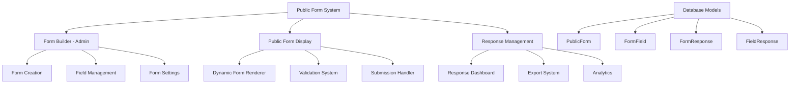

# 📋 Public Form Management System - Architecture Plan

## 🎯 Overview

A dynamic form builder system that allows administrators to create, customize, and manage public forms (like Google Forms) for various purposes such as:
- Free trial registrations
- Fitness assessments
- Contact inquiries
- Event registrations
- Custom questionnaires

## 🏗️ System Architecture



## 🗄️ Database Schema Design

Based on your existing Prisma schema, here are the new models needed:

```prisma
enum FormFieldType {
  TEXT
  EMAIL
  PHONE
  NUMBER
  TEXTAREA
  SELECT
  RADIO
  CHECKBOX
  DATE
  TIME
  FILE
  RATING
}

enum FormStatus {
  DRAFT
  PUBLISHED
  ARCHIVED
}

model PublicForm {
  id          String      @id @default(cuid())
  title       String
  description String?
  slug        String      @unique
  status      FormStatus  @default(DRAFT)
  isActive    Boolean     @default(true)
  
  // Design settings
  backgroundColor String?  @default("#ffffff")
  primaryColor    String?  @default("#BAD45E")
  logoUrl         String?
  
  // Behavior settings
  requireAuth     Boolean  @default(false)
  allowMultiple   Boolean  @default(true)
  showProgress    Boolean  @default(true)
  
  // Email notifications
  notifyOnSubmit  Boolean  @default(false)
  notifyEmails    String[] // JSON array of emails
  
  // Thank you page
  thankYouTitle   String?  @default("Thank you!")
  thankYouMessage String?  @default("Your response has been recorded.")
  redirectUrl     String?
  
  createdBy       String
  createdAt       DateTime @default(now())
  updatedAt       DateTime @updatedAt
  
  creator         User           @relation(fields: [createdBy], references: [id])
  fields          FormField[]
  responses       FormResponse[]
  
  @@index([slug])
  @@index([status])
  @@index([createdBy])
}

model FormField {
  id          String        @id @default(cuid())
  formId      String
  type        FormFieldType
  label       String
  placeholder String?
  helpText    String?
  
  // Validation
  required    Boolean       @default(false)
  minLength   Int?
  maxLength   Int?
  minValue    Decimal?
  maxValue    Decimal?
  pattern     String?       // Regex pattern
  
  // Options for SELECT, RADIO, CHECKBOX
  options     Json?         // Array of {value, label}
  
  // Display settings
  order       Int
  width       String?       @default("full") // "full", "half", "third"
  
  createdAt   DateTime      @default(now())
  updatedAt   DateTime      @updatedAt
  
  form        PublicForm    @relation(fields: [formId], references: [id], onDelete: Cascade)
  responses   FieldResponse[]
  
  @@index([formId])
  @@index([order])
}

model FormResponse {
  id          String          @id @default(cuid())
  formId      String
  
  // Respondent info (if not anonymous)
  respondentEmail String?
  respondentName  String?
  ipAddress       String?
  userAgent       String?
  
  submittedAt DateTime        @default(now())
  
  form        PublicForm      @relation(fields: [formId], references: [id], onDelete: Cascade)
  fieldResponses FieldResponse[]
  
  @@index([formId])
  @@index([submittedAt])
}

model FieldResponse {
  id         String       @id @default(cuid())
  responseId String
  fieldId    String
  value      String       // JSON string for complex values
  
  response   FormResponse @relation(fields: [responseId], references: [id], onDelete: Cascade)
  field      FormField    @relation(fields: [fieldId], references: [id], onDelete: Cascade)
  
  @@unique([responseId, fieldId])
  @@index([responseId])
  @@index([fieldId])
}
```

## 🎨 User Interface Structure

### Admin Interface (Form Builder)
```
/admin/forms/
├── page.tsx                    # Forms listing page
├── create/
│   └── page.tsx               # Form creation wizard
├── [formId]/
│   ├── edit/
│   │   └── page.tsx          # Form editor
│   ├── responses/
│   │   └── page.tsx          # Response dashboard
│   └── settings/
│       └── page.tsx          # Form settings
└── components/
    ├── form-builder.tsx       # Drag & drop form builder
    ├── field-editor.tsx       # Individual field editor
    ├── form-preview.tsx       # Live preview
    └── response-table.tsx     # Responses table
```

### Public Interface
```
/forms/
├── [slug]/
│   └── page.tsx              # Public form display
└── thank-you/
    └── page.tsx              # Thank you page
```

## 🔧 Core Features

### 1. Form Builder (Admin)
- **Drag & Drop Interface**: Simple field addition
- **Field Types**: Text, Email, Phone, Select, Radio, Checkbox, Date, File upload, Rating
- **Validation Rules**: Required fields, min/max length, custom patterns
- **Conditional Logic**: Show/hide fields based on responses
- **Preview Mode**: Real-time form preview
- **Template System**: Pre-built form templates

### 2. Form Management
- **Form Status**: Draft, Published, Archived
- **Access Control**: Public, require login, specific users
- **Response Limits**: Maximum submissions per user/IP
- **Schedule**: Form availability dates
- **Branding**: Custom colors, logo, styling

### 3. Public Form Display
- **Responsive Design**: Mobile-friendly forms
- **Progress Indicator**: Multi-step form progress
- **Auto-save**: Save progress as user types
- **Validation**: Real-time field validation
- **File Upload**: Support for document/image uploads
- **Captcha**: Spam protection

### 4. Response Management
- **Dashboard**: Response overview and analytics
- **Export**: CSV, Excel, PDF export
- **Search & Filter**: Find specific responses
- **Email Notifications**: Notify on new submissions
- **Response Details**: Individual response view

## 🛠️ Technical Implementation

### API Routes (tRPC)
```typescript
// src/server/api/routers/public-form.ts
export const publicFormRouter = createTRPCRouter({
  // Admin operations
  create: permissionProtectedProcedure(["create:public-form"]),
  update: permissionProtectedProcedure(["update:public-form"]),
  delete: permissionProtectedProcedure(["delete:public-form"]),
  getAll: permissionProtectedProcedure(["list:public-form"]),
  
  // Public operations (no auth required)
  getBySlug: publicProcedure,
  submit: publicProcedure,
  
  // Response management
  getResponses: permissionProtectedProcedure(["list:form-response"]),
  exportResponses: permissionProtectedProcedure(["export:form-response"]),
});
```

### Form Builder Components
- **FieldTypeSelector**: Choose field type
- **FieldEditor**: Configure field properties
- **FormPreview**: Live preview of form
- **ValidationBuilder**: Set up validation rules
- **StyleCustomizer**: Customize form appearance

### Public Form Renderer
- **DynamicForm**: Renders form based on configuration
- **FieldRenderer**: Renders individual fields
- **ValidationHandler**: Client-side validation
- **SubmissionHandler**: Form submission logic

## 📊 Analytics & Reporting

### Form Analytics
- **Submission Rate**: Completion vs abandonment
- **Field Analytics**: Which fields cause dropoffs
- **Time Analysis**: Average completion time
- **Device/Browser Stats**: Usage patterns
- **Geographic Data**: Submission locations

### Response Dashboard
- **Overview Cards**: Total submissions, completion rate
- **Charts**: Submission trends over time
- **Response Table**: Paginated response list
- **Export Options**: Multiple format support

## 🔒 Security & Privacy

### Data Protection
- **Input Sanitization**: Prevent XSS attacks
- **Rate Limiting**: Prevent spam submissions
- **File Upload Security**: Validate file types and sizes
- **GDPR Compliance**: Data retention and deletion

### Access Control
- **Form Permissions**: Who can create/edit forms
- **Response Access**: Who can view responses
- **Public Form Access**: IP restrictions, authentication
- **Data Export**: Audit trail for exports

## 🚀 Implementation Phases

### Phase 1: Core Foundation (Week 1-2)
- Database schema implementation
- Basic CRUD operations for forms
- Simple form builder interface
- Public form renderer

### Phase 2: Advanced Features (Week 3-4)
- Field validation system
- File upload functionality
- Response dashboard
- Basic analytics

### Phase 3: Enhancement (Week 5-6)
- Drag & drop form builder
- Advanced field types (rating, conditional logic)
- Email notifications
- Export functionality

### Phase 4: Polish & Optimization (Week 7-8)
- UI/UX improvements
- Performance optimization
- Advanced analytics
- Template system

## 🎯 Example Use Cases

### 1. Free Trial Registration
- Name, Email, Phone
- Preferred time slots
- Fitness experience level
- Health conditions checkbox
- Goals selection

### 2. Fitness Assessment
- Personal information
- Health history questionnaire
- Current fitness level rating
- Goals and preferences
- Photo upload for progress tracking

### 3. Event Registration
- Event selection
- Participant information
- Dietary requirements
- Emergency contact
- Payment method selection

## 💡 Integration Points

### Email System
- Use existing `EmailConfig` and `EmailTemplate` models
- Send confirmation emails to form submitters
- Notify administrators of new submissions

### User System
- Link responses to existing `User` accounts when applicable
- Use existing authentication for admin features
- Integrate with current role/permission system

### File Management
- Utilize existing `File` model for uploaded documents
- Integrate with current file upload system

## 🔧 Required Permissions

The following permissions should be added to the existing permission system:

```sql
-- Form Management Permissions
INSERT INTO "Permission" (id, name) VALUES 
  ('create_public_form', 'create:public-form'),
  ('update_public_form', 'update:public-form'),
  ('delete_public_form', 'delete:public-form'),
  ('list_public_form', 'list:public-form'),
  ('show_public_form', 'show:public-form'),
  ('list_form_response', 'list:form-response'),
  ('export_form_response', 'export:form-response');
```

This plan provides a comprehensive form management system that's simpler than Google Forms but powerful enough for your fitness business needs. The system will be fully integrated with your existing Next.js/Prisma/tRPC architecture.

## 📝 Next Steps

1. Update Prisma schema with new models
2. Create database migrations
3. Implement tRPC routers for form management
4. Build the admin form builder interface
5. Create public form display components
6. Implement response management dashboard
7. Add export and analytics features
8. Test and optimize the system

The implementation will follow the established patterns in your codebase and maintain consistency with your existing UI components and styling.