# Fit Infinity Application - Module Structure

## Mermaid Diagram

```mermaid
graph TB
    FitInfinity[Fit Infinity Application]
    
    %% Main Modules
    FitInfinity --> Management[Management]
    FitInfinity --> POS[Point of Sale]
    FitInfinity --> Administration[Administration]
    FitInfinity --> Membership[Membership]
    FitInfinity --> FC[Fitness Consultant]
    FitInfinity --> PT[Personal Trainer]
    FitInfinity --> Finance[Finance]
    FitInfinity --> Reports[Reports]
    
    %% Management Sub-modules
    Management --> M1[PT Calendar]
    Management --> M2[Personal Trainer]
    Management --> M3[Package]
    Management --> M4[Class]
    Management --> M5[Employee]
    Management --> M6[Fingerprint Device]
    Management --> M7[Attendance Management]
    Management --> M8[Users]
    Management --> M9[Voucher]
    Management --> M10[Role Permission]
    Management --> M11[Permission]
    Management --> M12[Role]
    Management --> M13[Fitness Consultant]
    Management --> M14[Payment List]
    Management --> M15[Rewards]
    Management --> M16[Email Settings]
    
    %% Point of Sale Sub-modules
    POS --> P1[POS Terminal]
    POS --> P2[Categories]
    POS --> P3[Items]
    
    %% Administration Sub-modules
    Administration --> A1[Dashboard]
    Administration --> A2[Payment Validation]
    Administration --> A3[Member]
    Administration --> A4[Class Registration]
    Administration --> A5[Check-in Logs]
    Administration --> A6[Class Attendance]
    Administration --> A7[Package Management]
    Administration --> A8[Group Management]
    Administration --> A9[Personal Trainer Management]
    Administration --> A10[Reward]
    Administration --> A11[Subscription History]
    
    %% Membership Sub-modules
    Membership --> MB1[Dashboard]
    Membership --> MB2[Classes]
    Membership --> MB3[Schedule]
    Membership --> MB4[Payment History]
    Membership --> MB5[My Groups]
    Membership --> MB6[Profile]
    Membership --> MB7[Body Tracking]
    
    %% Fitness Consultant Sub-modules
    FC --> FC1[Dashboard]
    FC --> FC2[Member Management]
    
    %% Personal Trainer Sub-modules
    PT --> PT1[Dashboard]
    PT --> PT2[Profile]
    PT --> PT3[Schedule]
    PT --> PT4[Member List]
    
    %% Finance Sub-modules
    Finance --> F1[Dashboard]
    Finance --> F2[Balance Account]
    Finance --> F3[Chart Of Account]
    Finance --> F4[Transactions]
    Finance --> F5[Payment History]
    
    %% Reports Sub-modules
    Reports --> R1[Member Attendance Report]
    Reports --> R2[Employee Attendance Report]
    Reports --> R3[Class Member Report]
    Reports --> R4[Personal Trainer Report]
    Reports --> R5[Sales Report]
    Reports --> R6[Commission Report]
    Reports --> R7[Cash Bank Report]
    
    %% Styling
    classDef mainModule fill:#e1f5fe,stroke:#01579b,stroke-width:2px
    classDef subModule fill:#f3e5f5,stroke:#4a148c,stroke-width:1px
    
    class Management,POS,Administration,Membership,FC,PT,Finance,Reports mainModule
    class M1,M2,M3,M4,M5,M6,M7,M8,M9,M10,M11,M12,M13,M14,M15,M16,P1,P2,P3,A1,A2,A3,A4,A5,A6,A7,A8,A9,A10,A11,MB1,MB2,MB3,MB4,MB5,MB6,MB7,FC1,FC2,PT1,PT2,PT3,PT4,F1,F2,F3,F4,F5,R1,R2,R3,R4,R5,R6,R7 subModule
```

## Module Breakdown

### 1. Management (16 modules)
- PT Calendar
- Personal Trainer
- Package
- Class
- Employee
- Fingerprint Device
- Attendance Management
- Users
- Voucher
- Role Permission
- Permission
- Role
- Fitness Consultant
- Payment List
- Rewards
- Email Settings

### 2. Point of Sale (3 modules)
- POS Terminal
- Categories
- Items

### 3. Administration (11 modules)
- Dashboard
- Payment Validation
- Member
- Class Registration
- Check-in Logs
- Class Attendance
- Package Management
- Group Management
- Personal Trainer Management
- Reward
- Subscription History

### 4. Membership (7 modules)
- Dashboard
- Classes
- Schedule
- Payment History
- My Groups
- Profile
- Body Tracking

### 5. Fitness Consultant (2 modules)
- Dashboard
- Member Management

### 6. Personal Trainer (4 modules)
- Dashboard
- Profile
- Schedule
- Member List

### 7. Finance (5 modules)
- Dashboard
- Balance Account
- Chart Of Account
- Transactions
- Payment History

### 8. Reports (7 modules)
- Member Attendance Report
- Employee Attendance Report
- Class Member Report
- Personal Trainer Report
- Sales Report
- Commission Report
- Cash Bank Report

## Total: 8 Main Modules with 55 Sub-modules