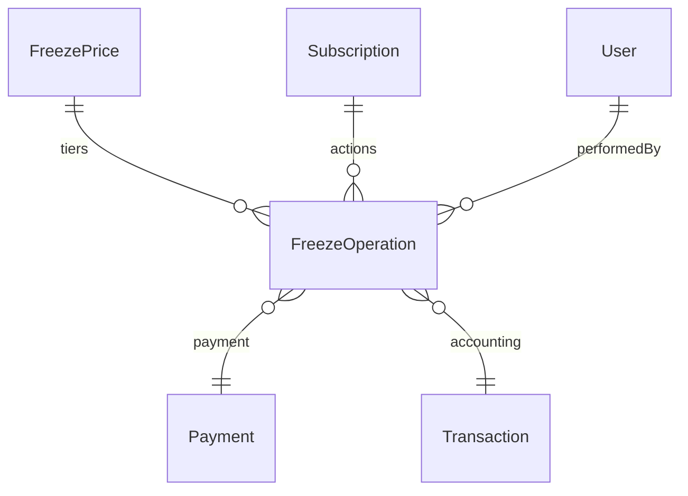

# Freeze Pricing System: Database Schema Specification

## 1. FreezePrice Model

```prisma
model FreezePrice {
  id         String   @id @default(cuid())
  freezeDays Int      // Number of days for this freeze tier
  price      Int      // Price in smallest currency unit (e.g., cents)
  isActive   Boolean  @default(true)
  createdAt  DateTime @default(now())
  updatedAt  DateTime @updatedAt

  freezeOperations FreezeOperation[]
}
```

## 2. FreezeOperation Model

```prisma
model FreezeOperation {
  id             String      @id @default(cuid())
  subscriptionId String
  freezePriceId  String
  transactionId  Int?
  operationType  FreezeOperationType
  freezeDays     Int
  price          Int
  performedAt    DateTime    @default(now())
  performedById  String

  subscription   Subscription @relation(fields: [subscriptionId], references: [id])
  freezePrice    FreezePrice  @relation(fields: [freezePriceId], references: [id])
  transaction    Transaction? @relation(fields: [transactionId], references: [id])
  performedBy    User         @relation(fields: [performedById], references: [id])
}

enum FreezeOperationType {
  FREEZE
  UNFREEZE
}
```

## 3. Model Modifications

- **Subscription**
  - Add: `freezeOperations FreezeOperation[]`

- **Payment**
  - Add: `freezeOperationId String?`
  - Add: `freezeOperation FreezeOperation? @relation(fields: [freezeOperationId], references: [id])`

- **Transaction**
  - No schema change; FreezeOperation links to Transaction.

## 4. Relationships

- FreezePrice (1) ←→ (N) FreezeOperation
- Subscription (1) ←→ (N) FreezeOperation
- FreezeOperation (1) ←→ (1) Payment (optional)
- FreezeOperation (1) ←→ (1) Transaction (optional)
- FreezeOperation (N) ←→ (1) User (performedBy)

## 5. Migration Considerations

- Backfill historical freeze actions if needed.
- Set default values for new relations.
- Ensure referential integrity (cascade deletes, null on delete for payments/transactions).
- Update admin UI for FreezePrice CRUD.
- Update member UI to select freeze tier and show pricing.

## 6. Example Queries

**Admin: CRUD FreezePrice**
- Create: `prisma.freezePrice.create({ data: { freezeDays: 7, price: 50000 } })`
- Update: `prisma.freezePrice.update({ where: { id }, data: { price: 60000 } })`
- List: `prisma.freezePrice.findMany({ where: { isActive: true } })`
- Delete: `prisma.freezePrice.delete({ where: { id } })`

**Member: Select freeze tier and freeze subscription**
- List available tiers: `prisma.freezePrice.findMany({ where: { isActive: true } })`
- Create freeze operation: 
  ```
  prisma.freezeOperation.create({
    data: {
      subscriptionId,
      freezePriceId,
      operationType: 'FREEZE',
      freezeDays,
      price,
      performedById: memberId
    }
  })
  ```
- Log payment for freeze: 
  ```
  prisma.payment.create({
    data: {
      subscriptionId,
      amount: price,
      freezeOperationId
    }
  })
  ```

**Reporting:**
- Get all freeze operations for a member: 
  ```
  prisma.freezeOperation.findMany({
    where: { subscription: { memberId } }
  })
  ```
- Get freeze revenue by period:
  ```
  prisma.freezeOperation.aggregate({
    _sum: { price: true },
    where: { performedAt: { gte: start, lte: end }, operationType: 'FREEZE' }
  })
  ```

## 7. Mermaid Diagram



## 8. Recommendations

- Use `isActive` for soft-deleting freeze tiers.
- Validate freezeDays and price for business rules.
- Ensure UI supports selection and display of freeze pricing.
- Audit freeze actions for compliance.
