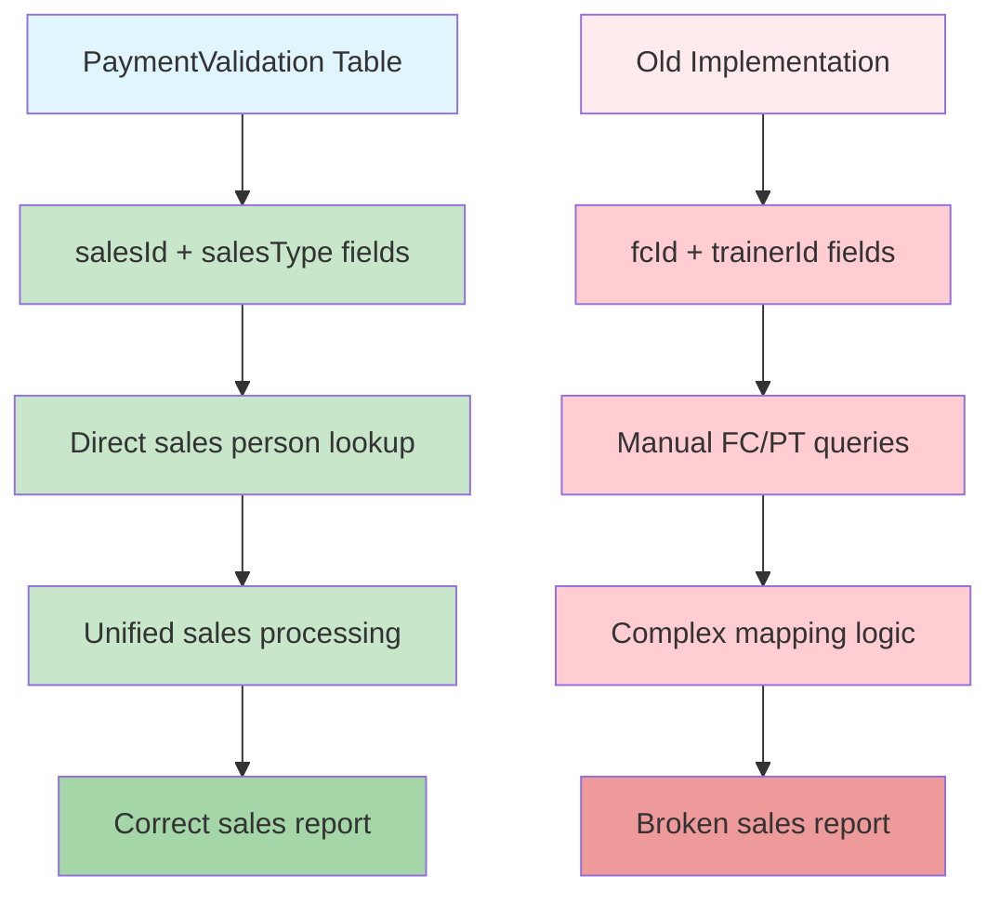

# Sales Report Fix Implementation Plan

## Problem Analysis

The current sales report implementation in [`src/server/api/routers/salesReport.ts`](src/server/api/routers/salesReport.ts) incorrectly uses the old `fcId` and `trainerId` fields instead of the proper `salesId` and `salesType` fields from the database schema.

### Current Issues

1. **Inconsistent Data Source**: The code queries FC and PersonalTrainer tables separately instead of using the unified `salesId`/`salesType` fields
2. **Complex Logic**: Manual mapping between `fcId`/`trainerId` to sales persons instead of direct lookup
3. **Incorrect Filtering**: Sales filtering uses separate field comparisons instead of unified `salesId`
4. **Debug Code**: Excessive console.log statements that should be removed

### Database Schema Reference

**Subscription Model** (lines 275-296):
```prisma
model Subscription {
    salesId           String?          // ID of the sales person (PersonalTrainer or FC)
    salesType         String?          // Type: "PersonalTrainer" or "FC"
    // ... other fields
}
```

**PaymentValidation Model** (lines 435-460):
```prisma
model PaymentValidation {
    salesId        String?                 // ID of the sales person (PersonalTrainer or FC)
    salesType      String?                 // Type: "PersonalTrainer" or "FC"
    fcId           String?                 // OLD FIELD - should not be used
    trainerId      String?                 // OLD FIELD - should not be used
    // ... other fields
}
```

## Implementation Plan

### Task 1: Update getSalesList Query
**File**: `src/server/api/routers/salesReport.ts` (lines 54-66)

**Current Implementation**:
```typescript
getSalesList: protectedProcedure.query(async ({ ctx }) => {
  const fcs = await ctx.db.fC.findMany({
    select: { id: true, user: { select: { name: true } } },
  });
  const pts = await ctx.db.personalTrainer.findMany({
    select: { id: true, user: { select: { name: true } } },
  });

  return [
    ...fcs.map(fc => ({ id: fc.id, name: fc.user.name!, type: 'FC' })),
    ...pts.map(pt => ({ id: pt.id, name: pt.user.name!, type: 'PT' })),
  ];
}),
```

**New Implementation**:
- Query PaymentValidation records to get unique salesId/salesType combinations
- Join with FC and PersonalTrainer tables based on salesType
- Return unified sales list

### Task 2: Refactor getRevenueBySales Query
**File**: `src/server/api/routers/salesReport.ts` (lines 68-208)

**Current Issues** (lines 147-158):
```typescript
// Cek berdasarkan fcId (untuk FC)
if (pv.fcId && pv.fc) {
  salesPersonId = pv.fcId;
  salesName = pv.fc.user.name!;
  salesType = 'FC';
}
// Cek berdasarkan trainerId (untuk PT)
else if (pv.trainerId && pv.trainer) {
  salesPersonId = pv.trainerId;
  salesName = pv.trainer.user.name!;
  salesType = 'PT';
}
```

**New Implementation**:
- Use `pv.salesId` and `pv.salesType` directly
- Remove complex conditional logic
- Simplify sales person identification

### Task 3: Update Sales Filtering Logic
**File**: `src/server/api/routers/salesReport.ts` (lines 182-184)

**Current Implementation**:
```typescript
finalPayments = filteredPayments.filter(pv =>
  pv.fcId === salesId || pv.trainerId === salesId
);
```

**New Implementation**:
```typescript
finalPayments = filteredPayments.filter(pv =>
  pv.salesId === salesId
);
```

### Task 4: Remove Debug Code
**File**: `src/server/api/routers/salesReport.ts` (lines 78-130, 190-195)

Remove all `console.log` statements:
- Lines 78-79: Date range and salesId logging
- Lines 119-130: Sample data logging
- Lines 135-137: Filtered payments logging
- Lines 161-167: Payment processing logging
- Lines 190-195: Final summary logging

### Task 5: Clean Up Database Queries
**File**: `src/server/api/routers/salesReport.ts` (lines 80-117)

**Current Select Fields**:
```typescript
select: {
  // ... other fields
  salesId: true,
  salesType: true,
  fcId: true,        // REMOVE - not needed
  trainerId: true,   // REMOVE - not needed
  // ... other fields
  trainer: {         // REMOVE - not needed with new approach
    select: {
      user: { select: { name: true } }
    }
  },
  fc: {             // REMOVE - not needed with new approach
    select: {
      user: { select: { name: true } }
    }
  },
}
```

**New Select Fields**:
- Keep `salesId` and `salesType`
- Remove `fcId`, `trainerId`, `trainer`, and `fc` relations
- Add proper joins based on `salesType` when needed

## Data Flow Diagram



## Expected Outcomes

After implementing these changes:

1. **Simplified Code**: Remove complex conditional logic and manual table joins
2. **Consistent Data**: Use standardized `salesId`/`salesType` fields throughout
3. **Better Performance**: Eliminate unnecessary database queries and relations
4. **Easier Maintenance**: Clear, straightforward code that follows the schema design
5. **Correct Functionality**: Sales filtering and reporting will work as intended

## Testing Requirements

1. **Sales List Display**: Verify that the sales dropdown shows correct FC and PT names
2. **Revenue Calculation**: Ensure revenue is correctly attributed to each sales person
3. **Sales Filtering**: Test that selecting a specific sales person filters data correctly
4. **Export Functionality**: Confirm Excel export contains accurate sales information
5. **Date Range Filtering**: Verify that date filters work properly with the new implementation

## Risk Assessment

**Low Risk**: Since the `salesId` and `salesType` fields are already populated in the database, this is primarily a code refactoring task with minimal data migration concerns.

**Rollback Plan**: If issues arise, the changes can be easily reverted since we're only modifying the API logic, not the database structure.